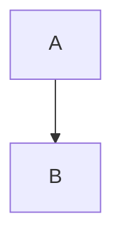

# /claude-sdd:sdd-publish — Confluence 퍼블리싱

SDD 라이프사이클 산출물을 Confluence에 자동 퍼블리싱합니다. 마크다운을 Confluence storage format으로 변환하고, 다이어그램을 PNG로 생성하여 첨부합니다.

## 사용법

```
/claude-sdd:sdd-publish                                    # 대화형 문서 선택 후 퍼블리싱
/claude-sdd:sdd-publish --all                              # 변경된 전체 산출물 퍼블리싱
/claude-sdd:sdd-publish --stage=spec                       # 특정 단계만
/claude-sdd:sdd-publish --stage=intake                     # intake 단계만
/claude-sdd:sdd-publish --domain=device-mgmt               # 특정 도메인만
/claude-sdd:sdd-publish confluence:SPACE_KEY/PAGE_ID       # 직접 지정 (config 무시)
/claude-sdd:sdd-publish https://company.atlassian.net/...  # URL로 직접 지정
```

## 인자

- `--all` — 변경된 전체 산출물 퍼블리싱 (선택 없이 일괄 처리)
- `--stage=<name>` — 특정 단계 산출물만 퍼블리싱 (intake, spec, plan, review, change, analysis)
- `--domain=<id>` — 특정 도메인 산출물만 (멀티 도메인)
- `confluence:SPACE_KEY/PAGE_ID` — config 무시, 직접 대상 지정
- `https://...` — Confluence URL에서 space_key와 page_id를 파싱

## 사전 조건

1. `docs/specs/sdd-config.yaml`을 읽어 `publishing.confluence` 설정을 확인합니다.
2. `publishing.confluence.enabled: true`가 아니면 안내합니다:
   ```
   Confluence 퍼블리싱이 설정되지 않았습니다.
   설정하려면 /claude-sdd:sdd-init를 실행하거나 sdd-config.yaml에 publishing 섹션을 추가하세요.
   ```
3. `confluence:` 또는 URL 인자가 있으면 config 없이도 실행합니다 (일회성 퍼블리싱).
4. MCP 서버 연결을 확인합니다.

---

## 동작

### 1단계: 산출물 스캔

`docs/specs/` 디렉토리를 스캔하여 퍼블리싱 대상 파일을 수집합니다.

**산출물-페이지 매핑:**

| 파일 | 페이지 제목 | 다이어그램 |
|------|------------|-----------|
| `00-project-context.md` | 프로젝트 컨텍스트 | — |
| `01-requirements.md` | 요구사항 | — |
| `02-architecture.md` | 아키텍처 | 의존성 다이어그램 |
| `03-api-spec.md` / `03-api-changes.md` | API 스펙 | — |
| `04-data-model.md` / `04-data-migration.md` | 데이터 모델 | ER 다이어그램 |
| `05-component-breakdown.md` / `05-component-changes.md` | 컴포넌트 분해 | 상호작용 다이어그램 |
| `06-spec-checklist.md` | 스펙 체크리스트 | — |
| `07-task-plan.md` | 태스크 계획 | — |
| `08-review-report.md` | 리뷰 보고서 | — |
| `09-change-request.md` | 변경 요청 | — |
| `10-analysis-report.md` | 분석 보고서 (레거시) | — |

### 2단계: 변경 감지

각 파일에 대해 `publishing.confluence.sync.timestamps`의 마지막 퍼블리싱 시각과 파일 수정 시각(mtime)을 비교합니다.

- 파일이 더 최신이면 → 퍼블리싱 대상
- 파일이 더 오래되었거나 같으면 → 건너뜀 (변경 없음)
- `timestamps`에 기록이 없으면 → 신규 퍼블리싱 대상

`--stage` 옵션이 있으면 해당 단계 파일만 필터링합니다.

### 2.5단계: 문서 선택 (대화형)

`--all`, `--stage`, `confluence:`, URL 인자가 **없는** 경우 (인자 없이 `/claude-sdd:sdd-publish`만 실행), 퍼블리싱할 문서를 사용자가 선택합니다.

1. 2단계에서 감지된 **변경된 파일 목록**과 **변경 없는 파일 목록**을 표시합니다:
   ```
   퍼블리싱할 문서를 선택하세요:

   변경됨 (신규/업데이트):
     [1] 01-요구사항          (신규)
     [2] 02-아키텍처          (업데이트, 다이어그램 1개)
     [3] 03-API 스펙          (신규)
     [4] 04-데이터 모델        (신규, ER 다이어그램)
     [5] 05-컴포넌트 분해      (신규)
     [6] 06-스펙 체크리스트    (업데이트)

   변경 없음:
     [7] 00-프로젝트 컨텍스트  (변경 없음)
     [8] 07-태스크 계획        (변경 없음)

   선택 (번호, 쉼표 구분 / all / 1-6 범위 / Enter=변경분만):
   ```

2. 사용자 입력 해석:
   - `1,3,6` → 지정된 문서만 퍼블리싱
   - `1-6` → 범위 내 문서 퍼블리싱
   - `all` → 모든 문서 퍼블리싱 (변경 없는 문서 포함, 강제 업데이트)
   - Enter (빈 입력) → 변경된 문서만 퍼블리싱 (기본값)

3. 선택된 문서만 3단계로 전달합니다.

**참고**: `--all`, `--stage`, `confluence:`, URL 인자가 있으면 이 단계를 건너뛰고 바로 3단계로 진행합니다.

### 3단계: 마크다운 → Confluence 변환 + 퍼블리싱

각 변경된 파일에 대해 **5단계 변환 파이프라인**을 실행합니다.

`templates/confluence/` 디렉토리의 템플릿을 활용합니다.

> **⚠ CRITICAL: 이 변환은 단순 마크다운→HTML 변환이 아닙니다. Confluence storage format 전용 변환입니다.**
> - 일반 `<pre><code>` 대신 `<ac:structured-macro ac:name="code">` 사용
> - 일반 `` 대신 `<ac:image><ri:attachment>` 사용
> - 일반 `<blockquote>` 대신 `<ac:structured-macro ac:name="info/warning/note">` 사용
> - 변환 결과에 `<ac:` 접두사 매크로가 **반드시** 포함되어야 합니다
> - 표준 HTML 태그(`<pre>`, ``, `<blockquote>`)가 최종 출력에 남아있으면 **변환 실패**입니다
>
> **절대 하지 말 것**: 마크다운을 일반 HTML로 변환한 뒤 MCP로 업로드하는 것. 반드시 아래 3-1 ~ 3-5 단계를 순서대로 적용한 결과물만 업로드합니다.

#### 3-1. 전처리: 메타데이터 추출

파일에서 메타데이터를 추출합니다:
- **제목**: 첫 번째 `#` 헤더
- **스펙 ID**: 파일명에서 추출 (예: `02-architecture.md` → `ARCH`)
- **진행률**: `[x]`/`[ ]` 카운트 (체크리스트 파일)
- **프로젝트명/유형/날짜**: `sdd-config.yaml`에서 읽기

#### 3-2. 기본 변환

| 마크다운 소스 | Confluence 출력 |
|-------------|----------------|
| `#`, `##`, `###` 헤더 | `<h1>`, `<h2>`, `<h3>` |
| 코드 블록 (` ```lang ... ``` `) | `code-block.xml.tmpl` 사용 (`<ac:structured-macro ac:name="code">`) |
| 체크리스트 (`- [x]`, `- [ ]`) | Confluence 체크리스트 매크로 |
| 테이블 | Confluence 테이블 (`<table>`) |
| 인라인 코드 (`\`code\``) | `<code>` |
| 볼드/이탤릭 | `<strong>`, `<em>` |
| 링크 (`[text](url)`) | `<a href="url">text</a>` |

**변환 예시 (코드 블록)** — ` ```lang ``` ` 을 반드시 `<ac:structured-macro>`로 변환:

입력 (마크다운):
````
```java
public class UserService {
    private final UserRepository repo;
}
```
````

출력 (Confluence storage format):
```xml
<ac:structured-macro ac:name="code">
  <ac:parameter ac:name="language">java</ac:parameter>
  <ac:parameter ac:name="linenumbers">true</ac:parameter>
  <ac:parameter ac:name="collapse">false</ac:parameter>
  <ac:plain-text-body><![CDATA[public class UserService {
    private final UserRepository repo;
}]]></ac:plain-text-body>
</ac:structured-macro>
```

**주의**: `<pre class="highlight"><code class="language-java">` 형태로 변환하면 안 됩니다. 반드시 `<ac:structured-macro ac:name="code">`를 사용합니다.

#### 3-3. 향상 변환

| 마크다운 소스 | Confluence 출력 | 템플릿 |
|-------------|----------------|--------|
| `> *자동 생성*` (일반 blockquote) | 정보 패널 | `info-panel.xml.tmpl` (type=info) |
| `> **경고**:` (경고 blockquote) | 경고 패널 | `info-panel.xml.tmpl` (type=warning) |
| `> **참고**:` (참고 blockquote) | 참고 패널 | `info-panel.xml.tmpl` (type=note) |
| `> **팁**:` (팁 blockquote) | 팁 패널 | `info-panel.xml.tmpl` (type=tip) |
| 긴 코드 블록 (20줄 이상) | expand 매크로 안에 code 매크로 중첩 | `expand-macro.xml.tmpl` + `code-block.xml.tmpl` |
| HTTP 메서드 (`POST`, `GET`, `PUT`, `PATCH`, `DELETE`) | 상태 배지 매크로 | `status-macro.xml.tmpl` |
| ` ```mermaid ... ``` ` 블록 | expand 매크로(접힘) 안에 code 매크로(language=mermaid) 중첩 | `expand-macro.xml.tmpl` + `code-block.xml.tmpl` |

**변환 예시 (Blockquote → 패널)**:

입력 (마크다운):
```
> *이 문서는 SDD 도구에 의해 자동 생성되었습니다.*
```

출력 (Confluence storage format):
```xml
<ac:structured-macro ac:name="info">
  <ac:rich-text-body>
    <p><em>이 문서는 SDD 도구에 의해 자동 생성되었습니다.</em></p>
  </ac:rich-text-body>
</ac:structured-macro>
```

**주의**: `<blockquote>` 태그로 변환하면 안 됩니다. 반드시 `<ac:structured-macro ac:name="info/warning/note/tip">`을 사용합니다.

**변환 예시 (Mermaid 블록 → 접힌 코드 블록)**:

입력 (마크다운):
````

````

출력 (Confluence storage format):
```xml
<ac:structured-macro ac:name="expand">
  <ac:parameter ac:name="title">Mermaid 다이어그램 소스</ac:parameter>
  <ac:rich-text-body>
    <ac:structured-macro ac:name="code">
      <ac:parameter ac:name="language">mermaid</ac:parameter>
      <ac:parameter ac:name="linenumbers">false</ac:parameter>
      <ac:parameter ac:name="collapse">false</ac:parameter>
      <ac:plain-text-body><![CDATA[graph TB
  A --> B]]></ac:plain-text-body>
    </ac:structured-macro>
  </ac:rich-text-body>
</ac:structured-macro>
```

Mermaid 블록은 PNG 다이어그램 바로 아래에 접힌 상태로 표시됩니다. `<pre><code class="language-mermaid">` 형태로 변환하면 안 됩니다.

**HTTP 메서드 색상 매핑** (03-api-spec.md 전용):

| 메서드 | 색상 |
|--------|------|
| `GET` | Blue |
| `POST` | Green |
| `PUT` | Yellow |
| `PATCH` | Yellow |
| `DELETE` | Red |

#### 3-4. 래핑

`page-wrapper.xml.tmpl` 템플릿으로 전체 페이지를 래핑합니다:
- 상단: 프로젝트 정보 패널 (프로젝트명, 유형, 갱신일)
- TOC 매크로 (maxLevel=3)
- 구분선
- 본문

#### 3-5. 다이어그램 변환

- `` → `<ac:image><ri:attachment ri:filename="xxx.png"/></ac:image>`
- `docs/specs/diagrams/` (또는 도메인별 `diagrams/`)에 기존 PNG가 있고, 소스 md 파일보다 최신(mtime 비교)이면 **재사용**
- 기존 PNG가 없거나 소스보다 오래된 경우, 스펙 파일에서 Mermaid 블록을 추출하여 mmdc로 PNG 재생성:
  ```bash
  npx mmdc -i /tmp/diagram.mmd -o <출력경로>/XX-name.png \
    -b white -s 2 -c {플러그인}/scripts/mermaid-config.json
  ```

**변환 예시 (이미지 → Confluence 첨부 참조)**:

입력 (마크다운):
```

```

출력 (Confluence storage format):
```xml
<ac:image ac:alt="모듈 의존성"><ri:attachment ri:filename="02-module-dependency.png"/></ac:image>
```

**주의**: `` 형태로 변환하면 안 됩니다. Confluence에서 첨부된 이미지는 반드시 `<ac:image><ri:attachment>` 매크로를 사용해야 표시됩니다.

#### 3.5단계: 변환 결과 검증 (API 호출 전)

변환된 Confluence storage format을 MCP로 전송하기 **전에** 다음을 반드시 확인합니다:

| # | 검증 항목 | 실패 조건 | 원인 |
|---|----------|----------|------|
| 1 | `mermaid</ac:parameter>`는 정상) | 있으면 | 3-3단계 미적용 |
| 4 | `<blockquote>` 패턴이 **없어야** 함 | 있으면 | 3-3단계 미적용 |
| 5 | `<ac:structured-macro` 패턴이 **최소 1회** 있어야 함 | 없으면 | 전체 파이프라인 미적용 |

**하나라도 실패하면** 3단계 변환을 처음부터 재수행합니다. 재수행 후에도 실패하면 사용자에게 에스컬레이션합니다.

### 파일별 특수 변환 규칙

| 파일 | 특수 변환 |
|------|-----------|
| `06-spec-checklist.md` | 상단에 진행률 요약 패널 (`checklist-summary.xml.tmpl`), 카테고리별 status 매크로 |
| `02-architecture.md` | 기술 스택 테이블 헤더에 배경색 적용 |
| `03-api-spec.md` | HTTP 메서드에 status 매크로 (GET=Blue, POST=Green, DELETE=Red) |
| `08-review-report.md` | 통과/실패에 status 매크로 (PASS=Green, FAIL=Red) |

### 4단계: Confluence API 호출

1. **페이지 생성/업데이트**:
   - `page_ids`에 ID가 있으면 → `confluence_update_page` MCP 도구로 업데이트
   - `page_ids`에 ID가 없으면 → `confluence_create_page` MCP 도구로 신규 생성
     - 부모 페이지: `root_page_id`
     - 생성 후 반환된 page_id를 `page_ids`에 저장

2. **PNG 첨부** (다이어그램이 있는 경우):
   - `scripts/sdd-confluence-upload.py`를 실행하여 PNG를 Confluence 페이지에 첨부
   - 이 스크립트는 `~/.claude.json`에서 MCP 서버의 인증 정보를 추출하여 `atlassian-python-api`로 첨부

3. **타임스탬프 업데이트**: `publishing.confluence.sync.timestamps`에 현재 시각 기록

### 5단계: sdd-config.yaml 저장

변경된 `timestamps`와 `page_ids`를 `sdd-config.yaml`에 저장합니다.

### 6단계: 결과 대시보드

```
╔═══════════════════════════════════════╗
║  Confluence 퍼블리싱 완료              ║
╚═══════════════════════════════════════╝

  산출물               상태       URL
  ─────────────────────────────────────────
  00-프로젝트 컨텍스트  — 변경없음
  01-요구사항          ✓ 업데이트  https://company.atlassian.net/wiki/...
  02-아키텍처          ✓ 신규생성  https://company.atlassian.net/wiki/... (다이어그램 2개 첨부)
  03-API 스펙          — 변경없음
  04-데이터 모델        ✓ 업데이트  https://company.atlassian.net/wiki/... (ER 다이어그램 첨부)
  05-컴포넌트 분해      — 변경없음
  06-스펙 체크리스트    ✓ 업데이트  https://company.atlassian.net/wiki/...
  07-태스크 계획        — 변경없음

  퍼블리싱: 4개 업데이트, 3개 건너뜀
  다이어그램: 3개 생성 (Mermaid → mmdc)
```

---

## 페이지 계층

Confluence에 생성되는 페이지 계층:

```
루트 페이지 (사용자 지정)
├── 00-프로젝트 컨텍스트
├── 01-요구사항
├── 02-아키텍처          ← 의존성 다이어그램 PNG
├── 03-API 스펙
├── 04-데이터 모델        ← ER 다이어그램 PNG
├── 05-컴포넌트 분해      ← 상호작용 다이어그램 PNG
├── 06-스펙 체크리스트
├── 07-태스크 계획
├── 08-리뷰 보고서
├── 09-변경 요청
└── 10-분석 보고서 (레거시)
```

멀티 도메인인 경우:

```
루트 페이지
├── 00-프로젝트 컨텍스트
├── 01-요구사항 (인덱스)
├── 02-아키텍처 (프로젝트 수준)
├── 도메인: device-mgmt
│   ├── 01-요구사항
│   ├── 02-아키텍처
│   ├── 03-API 스펙
│   ├── 04-데이터 모델
│   ├── 05-컴포넌트 분해
│   └── 06-체크리스트
├── 도메인: subscription
│   └── ...
├── 크로스 도메인
│   ├── 의존성 맵
│   ├── 통합 포인트
│   └── 통합 체크리스트
├── 06-통합 체크리스트
├── 07-태스크 계획
└── 08-리뷰 보고서
```

---

## 다이어그램 생성 (Mermaid 기반)

스펙 파일에 포함된 Mermaid 코드 블록을 추출하여 mmdc (Mermaid CLI)로 PNG를 생성합니다.

### 렌더링 파이프라인

1. 스펙 파일에서 ` ```mermaid ``` ` 코드 블록을 찾습니다.
2. 블록 직후의 `` 참조에서 출력 파일명을 결정합니다.
3. Mermaid 코드를 임시 `.mmd` 파일에 저장합니다.
4. mmdc로 렌더링합니다:
   ```bash
   npx mmdc -i /tmp/diagram.mmd -o <출력경로>/XX-name.png \
     -b white -s 2 -c {플러그인}/scripts/mermaid-config.json
   ```
5. 렌더링 실패 시 경고(⚠)를 표시하고 계속 진행합니다.

### 지원 유형

| Mermaid 유형 | 대상 산출물 | PNG 파일명 |
|-------------|------------|-----------|
| `graph TB` (flowchart) | 02-architecture.md | 02-module-dependency.png |
| `erDiagram` | 04-data-model.md | 04-er-diagram.png |
| `sequenceDiagram` | 05-component-breakdown.md | 05-component-interaction.png |
| `graph TB` (flowchart) | 02-architecture.md (멀티) | 02-domain-boundary.png |

---

## PNG 첨부

`scripts/sdd-confluence-upload.py`를 사용하여 PNG를 Confluence 페이지에 첨부합니다.

이 스크립트는:
1. `~/.claude.json`에서 지정된 MCP 서버의 인증 정보 추출
2. `atlassian-python-api`의 `attach_file()` 메서드로 첨부
3. `CONFLUENCE_SSL_VERIFY` 환경변수를 참조하여 SSL 우회 설정

MCP 도구의 `confluence_update_page`는 첨부 파일 업로드를 지원하지 않으므로, Python 스크립트를 통해 직접 API를 호출합니다.

---

## 멀티 도메인 지원

### --domain=<id>

1. `docs/specs/domains/<domain-id>/` 디렉토리의 산출물만 퍼블리싱합니다.
2. Confluence에 도메인별 하위 페이지 그룹을 생성합니다.
3. 도메인 하위 페이지의 부모는 루트 페이지입니다.

### 전체 퍼블리싱 (인자 없음)

1. 프로젝트 수준 파일 (00~02, 06~10) 퍼블리싱
2. 각 도메인 디렉토리의 파일 퍼블리싱
3. 크로스 도메인 파일 퍼블리싱

---

## 출력

- Confluence 페이지 생성/업데이트
- PNG 다이어그램 파일 (`docs/specs/diagrams/`에 영구 저장 — `sdd-spec` 단계에서 생성, 퍼블리싱 시 재사용)
- `sdd-config.yaml` 업데이트 (timestamps, page_ids)

## 의존성

- `docs/specs/sdd-config.yaml` (`/claude-sdd:sdd-init`에서 생성)
- `publishing.confluence.enabled: true` 설정
- Atlassian MCP 서버 연결
- 다이어그램 생성: `mmdc` (Mermaid CLI — `npm i -g @mermaid-js/mermaid-cli`)
- PNG 첨부: `atlassian-python-api` Python 패키지
